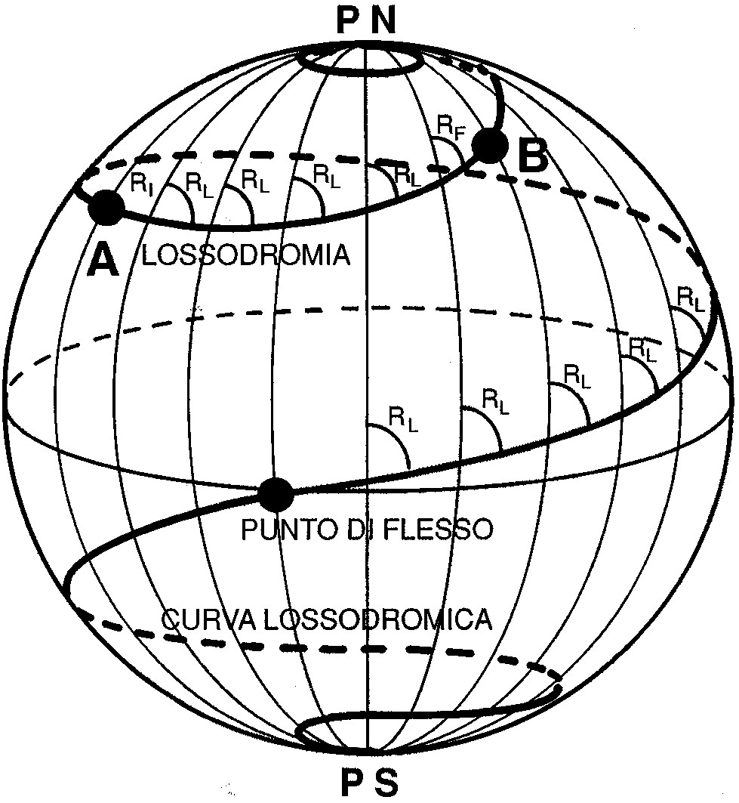
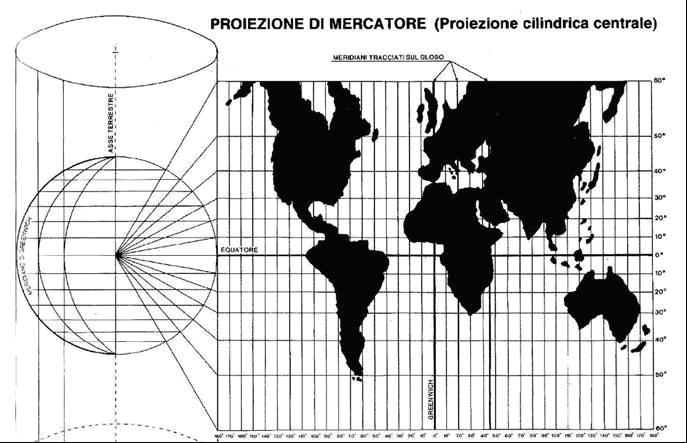
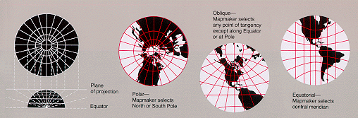

# Ortodromia e lossodromia

Dati due punti A e B, una rotta **ortodromica** *(dal greco: percorso dritto)* è una rotta sulla circonferenza massima 
ed è il percorso più breve tra i due punti. 
Interseca i meridiani ad angoli variabili e quindi richiede continui aggiustamenti di rotta.
È una linea retta sulla carta gnomonica.

Dati due punti A e B, una rotta **lossodromica** *(dal greco: percorso curvo)* è una rotta che incontra i meridiani con angolo costante.
Non è il percorso più breve, ma ha angolo costante e corrisponde ad una spirale che avvolge la Terra.
È una linea retta sulla carta di Mercatore.

<table border="0">
    <tr>
        <td style="width: 50%;">
            
        </td>
        <td style="width: 50%;">
            
        </td>
    </tr>
</table>

Per facilitare il percorso di una rotto ortodromico, è possibile suddividerla in più punti e tracciare rotte
lossodromiche tra questi punti: l'insieme di rotte così formato si chiama **spezzata lossodromica**.

# Carte nautiche

Le carte nautiche introducono inevitabilmente delle deformazioni, che possono riguardare le distanze, gli angoli e le 
aree.

In base alle caratteristiche di distorsione possiamo definire una carte come:
* Isometrica: conserva le distante lungo determinate direzioni
* Isogona: conserva gli angoli
* Equivalente: conserva il rapporto tra le aree

Per i nostri scopi, siamo particolarmente interessati alle carte isometriche. 
Non Esistono carte che siano contemporaneamente isometriche, isogone e equivalenti (se non a scale molto grandi).

## La carta di Mercatore

Si immagini di avvolgere un cilindro attorno alla Terra, allineato sull'asse di rotazione e tangente l'equatore in 
ogni suo punto: a partire dal centro della Terra si proiettano i punti della superficie della Terra sul cilindro.
    

* I meridiani sono linee rette parallele ed equidistanti.
* I paralleli sono linee rette parallele, a distanza crescente con la latitudine 
  (infatti la carta è anche detta *a latitudine crescente*). L'equatore è inalterato.

Le carte di mercatore sono sempre isogone. 
Nelle vicinanze dell'equatore, sono anche isometriche ed equivalenti.
Oltre i 70° di latitudine introduce deformazioni che rendono le carte di proiezioni poco usabili.
I poli non sono rappresentabili. 

Le distanze vanno misurate prendendo come riferimento la graduazione meridiana.
Diciamo quindi che la scala della latitudine corrisponde alla scala della distanze. 

Un primo di latitudine equivale a un miglio.

Una retta tracciata sulla carta di Mercatore è una rotta lossodromica.

## La carta gnomonica

Si immagini di porre un piano tangente ad un punto della superficie terrestre: a partire dal centro della Terra si 
proiettano i punti della superficie della Terra sul piano.

Distinguamo tre categorie:

* Polari: il piano è tangente ad uno dei due poli. I meridiani sono radiali ed equamente spaziati.
  I paralleli sono cerchi concentrici. L'equatore non è rappresentabile. 
* Meridiane: il piano è tangente a un punto dell'equatore. I meridiani sono paralleli ma non equidistanti.
  I paralleli sono iperboli. L'equatore è una linea retta perpendicolare a tutti i meridiani.
* Orizzontale (o Azimutimale): il piano è tangente a un punto qualsiasi della superficie terrestre.
  I meridiani sono rette che partono radialmente dal polo verso l'esterno, ma non sono equidistanti.
  I paralleli sono iperboli. L'equatore è una retta che è perpendicolare a un singolo meridiano.
  
La proiezione gnomonica rettifica i meridiani: una retta tracciata su una carta gnomonica è una rotta ortodromica.

## Le scale

Le carte si classificano in base alla scala (dalla scala più piccola alla scala più grande):

| Denominazione | Scala | Note |
| -- | -- | -- |
| Carte oceaniche | 1:6.000.000 | A piccolissima scala. |
| Carte generali | 1:1.000.000&nbsp;-&nbsp;1:350.000 | Utilizzate per rotte su grandi distanze. |
| Carte costiere | 1:250.000&nbsp;-&nbsp;1:100.000 | A piccola/media scala. Utilizzate per rotte su media/piccola distanza. |
| Carte costiere | 1:60.000&nbsp;-&nbsp;1:30.000| A grande scala. Usate per l'atterraggio e nei porti |
| Carte litorali | 1:30.000 ||
| Piano nautici e pianetti | 1:10.000 - 1:2.000 | Su queste scale è possibile ottenere carte isogone, isometriche e equivalenti. Si usano per piccole zone, isolotti, porti, rade

> #### info::
> Nota: più è piccolo il denominatore, più è grande la scala.

---

#### Fonti

* <a href="//commons.wikimedia.org/wiki/File:Ortodroma.svg" title="File:Ortodroma.svg">Ortodroma.svg</a>: <a href="//commons.wikimedia.org/wiki/User:Orem" title="User:Orem">Orem</a> derivative work: <a href="//commons.wikimedia.org/wiki/User:Ciaurlec" title="User:Ciaurlec">Ciaurlec</a> (<a href="//commons.wikimedia.org/wiki/User_talk:Ciaurlec" title="User talk:Ciaurlec">talk</a>) - <a href="//commons.wikimedia.org/wiki/File:Ortodroma.svg" title="File:Ortodroma.svg">Ortodroma.svg</a>, <a href="http://creativecommons.org/licenses/by-sa/3.0/" title="Creative Commons Attribution-Share Alike 3.0">CC BY-SA 3.0</a>, <a href="https://commons.wikimedia.org/w/index.php?curid=12384180">Collegamento</a>