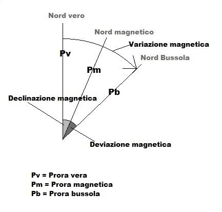

# Magnetismo

La Terra si comporta come un gigantesco magnete. Questo *magnete* è leggermente inclinato rispetto all'asse
di rotazione terrestre, e tale rotazione varia (lentamente) nel tempo.

Questo vuol dire che il nord indicato dalla bussola (**Nord magnetico**, ***Nm***) non coincide con il cosiddetto
**Nord Vero** (***Nv***, detto anche Nord Geografico) ma di discosta di un angolo detto 
**declinazione magnetica** (***d***).

> #### danger::
> 
> Il **Nord Vero** (**Nv**) detto anche *Nord Geografico* è quello indicato dalle carte e attraverso cui passano i 
> meridiani.
>
> Il **Nord Magnetico** (**Nm**) è quello indicato dalla bussola.
>
> La **Declinazione magnetica** (***d***) è l'angolo formato tra Nv e Nm.

## Declinazione magnetica

La declinazione varia da zona in zona, e nella stessa zona varia di anno in anno.
Può avere valore positivo (verso Est) oppure negativo (verso Ovest).

A causa della declinazione, alle alte latitudini (oltre i 65-70°) la bussola diventa inutilizzabile.
 
Sulle carte, la declinazione magnetica è riportata al centro della rosa graduata.
In particolare sono indicati:
- Anno di riferimento (es: "2001,0" indica gennaio 2010)
- Valore e segno della declinazione
- Valore e segno della variazione annua

> #### primary::Esempio: Aggiornare la carta
> 
> Supponiamo che sulla carta sia presente la seguente indicazione:
> > 2004,0 - decl. 1° 24' E - variaz 7' E
>
> * Aggiorniamo ad aprile 2013:
>   * Da gennario 2004 ad aprile 2013 sono 9 anni (compreso 2004, escluso 2013)
>   * Variazione totale: 9 &times; 7' E = 63' E = 1° 03' E
>   * Declinazione aggiornata: 1° 24' E + 1° 03' E = 2° 27' E
> * Aggiorniamo a luglio 2013:
>   * Luglio è oltre la metà dell'anno, contiamo quindi 10 anni trascorsi
>   * Variazione totale: 10 &times; 7' E = 1° 10' E
>   * Declinazione aggiornata: 1° 24' E + 1° 10' E = 2° 34' E

## Deviazione magnetica

La bussola non punta al Nm, ma al cosiddetto **Nord bussola** (***Nb***). Nm e Nb non corrispondono a causa dei
metalli presenti a bordo dell'imbarcazione che generano un **campo magnetico perturbatore**.

> #### danger::
>
> La **Deviazione magnetica** (***&delta;***) è l'angolo formato tra Nm e Nb.

&delta; varia al variare dell'angolo di prua.

### Giri di bussola
Per misurare &delta; ci si avvale di uno specialista detto *tecnico compensatore*.

Inizialmente si allinea l'imbarcazione a due punti della terraferma allineati e di orientamento
misurato (v. ad esempio i tralicci riportati all'imbocco del Lago Miseno), si punta la prua a Nord e si misura la
**variazione magnetica** (***d + &delta;***), che viene compensata dal tecnico apponendo un piccolo magnete
nei pressi della bussola. La compensazione viene ripetuta per i quattro punti cardinali.

Per gli errori che non si riesce a eliminare, si effettuano i **giri di bussola**: partendo dal Nord e a angoli
di 15°, si misura la deviazione residua e si compila la **Tabella delle deviazioni residue**.

Queste informazioni si usano per convertire prua vera e rotta vera in prua bussola e rotta bussola.

> #### info::
>
> La **Prua vera** (***Pv***) è l'angolo che la prua forma col Nv.
>
> La **Rotta vera** (***Rv***) è il percorso seguito e da seguire (come tracciato sulla carta).
>
> Pv e Rv coincidono in assenza di vento e corrente.

[^1]

La bussola e la tabella delle deviazioni residue...
* non sono obbligatorie sui natanti (&le; 10m);
* sono obbligatori per imbarcazioni (10 &divide; 24m) se navigano a oltre 6 miglia dalla costa;
* sono obbligatori per le navi (&gt; 24m).

---

[^1] http://www.scuolanauticadelta.it/1/declinazione_e_deviazione_919548.html
