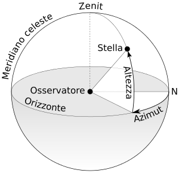
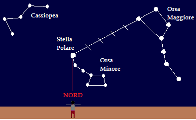

# Cenni di astronomia

La **linea meridiana** è la retta di intersezione del piano meridiano con il piano orizzontale dell'osservatore.
La linea meridiana punta in alto verso lo Zenit, e in basso verso il Nadir.

La semiretta diretta verso il Polo Nord è detta **direzione cardinale Nord**

l'**Azimuth** è l'arco di orizzonte compreso tra il punto cardinale nord (Nv) e la direzione di un
punto sull'orizzonte.

 [^1]

Per i Romani, le sette stelle del Piccolo Carro erano *sette buoi*, probabilmente dal numero 7 viene il nome
di Settentrione per indicare il Nord.

Per orientarsi verso Nord, si osserva la Stella Polaris. Per identificarla, si cerca l'Orsa Maggiore
(o Grande Carro) e si individua la base (le stelle Merak e Dubhe). La Stella Polare è a cinque volte la distanza
tra Merak e Dubhe.

Se l'Orsa Maggiore non è visibile, è possibile fare riferimento a Cassiopea.

 [^2]

Per l'orientamento durante il giorno si osserva il sole: sorge a Est, tramonta a Ovest, alle nostre
latitufini a mezzogiorno indica il Sud.

---

[^1] By Neq00 [CC BY-SA 4.0](http://creativecommons.org/licenses/by-sa/4.0), via Wikimedia Commons
[url](https://commons.wikimedia.org/wiki/File:Azimuth-Altitude_schematic_it.svg)

[^2] http://www.schededigeografia.net/orientamento/orientarsi_con_la_stella_polare.htm