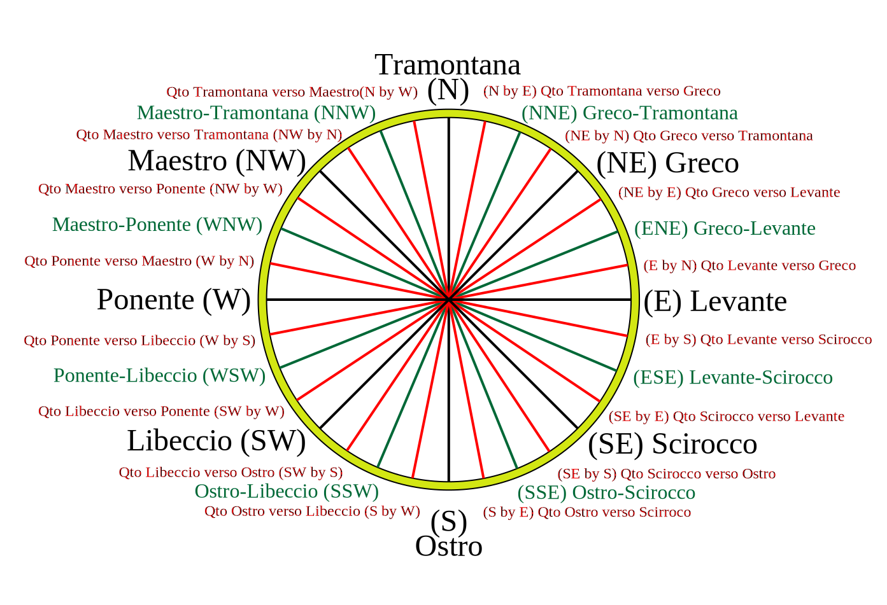

# La Rosa dei venti

Dividiamo il piano cartesiano in quattro quadranti, secondo le quattro direzioni cardinali:

<pre>
           N
           |
     IV    |    I
           |
  W -------+------- E
           |
    III    |    II
           |
           S
</pre>

A seconda della direzione cardinale di provenienza, i venti vengono chiamati:

| Direzione cardinale | Vento | Direzione angolare |
| ------------------- | ----- | -----------------: |
| N  | Tramontana / Borea  | 0   |
| NE | Greco / Grecale     | 45  |
| E  | Levante             | 90  |
| SE | Scirocco            | 135 |
| S  | Mezzogiorno / Ostro | 180 |
| SW | Libeccio            | 225 |
| W  | Ponente / Espero    | 270 |
| NW | Maestrale           | 315 |

Sulla rosa distinguiamo:

* **Punti cardinali** (ogni 90°): N, S, E, W
* **Punti intercardinali** (ogni 45°): NE, SE, SW, NW
* **Mezzi venti** (ogni 22° 30'), in tutto 8: N-NE, E-NE, E-SE, S-SE, S-SW, W-SW, W-NW, N-NW
* **Rombi** o **Quarte di vento** (ogni 11° 15'), in tutto 16
* **Mezze quarte** (ogni 5° 37' 30"), in tutto 32
* **Quartine** (ogni 2° 48° 45"), in tutto 64

 [^1]

---

[^1] By Fred the Oyster [GFDL](http://www.gnu.org/copyleft/fdl.html) or
[CC BY-SA 4.0-3.0-2.5-2.0-1.0](http://creativecommons.org/licenses/by-sa/4.0-3.0-2.5-2.0-1.0)], via Wikimedia Commons
[url](https://commons.wikimedia.org/wiki/File:32-point_compass_(traditional_winds).svg)